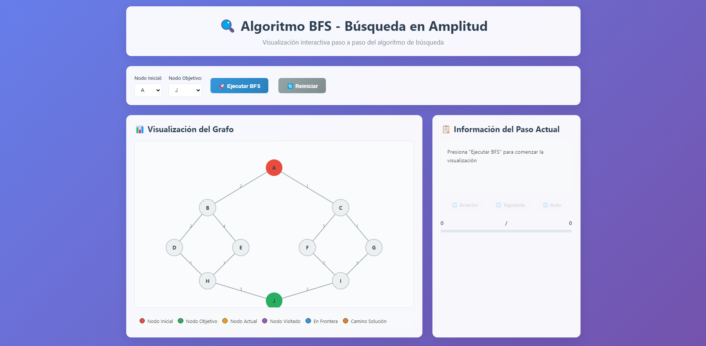
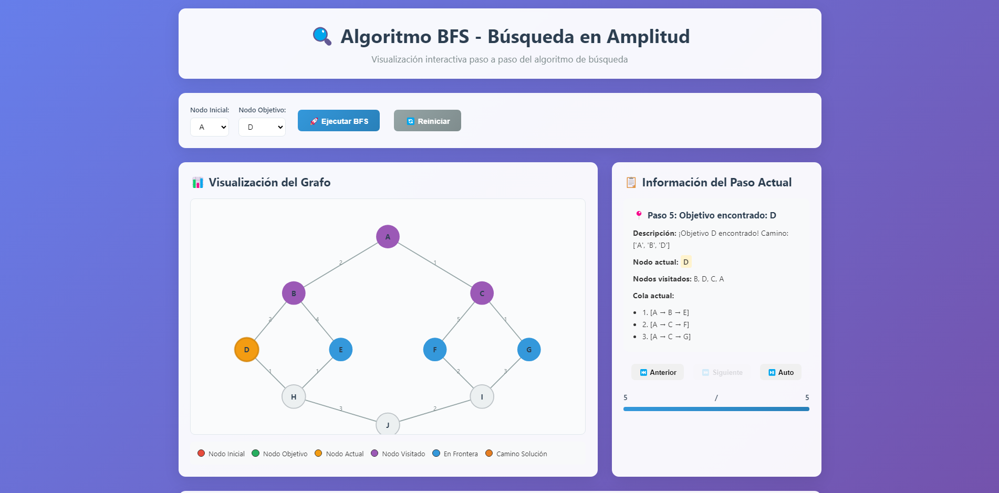

# 🔍 BFS Algorithm Visualization

Actividad de Fundamentos de inteligencia artificial para aprender el algoritmo de **Búsqueda en Amplitud (BFS)** con visualización interactiva paso a paso.

## ⚡ Quick Start

```bash
# 1. Clonar el repositorio
git clone https://github.com/victortelles/BFS-Busqueda-en-Amplitud.git
cd BFS-Busqueda-en-Amplitud

# 2. Instalar dependencias
pip install flask

# 3. Ejecutar servidor
python app.py

# 4. Abrir navegador en: http://localhost:5000
```

## 📋 Tabla de Contenidos

- [📋 Descripción del Proyecto](#-descripción-del-proyecto)
- [🏗️ Estructura del Proyecto](#️-estructura-del-proyecto)
- [🚀 Instalación y Ejecución](#-instalación-y-ejecución)
- [🎬 Demo en Vivo](#-demo-en-vivo)
- [📸 Capturas de Pantalla](#-capturas-de-pantalla)
- [📚 Características del Algoritmo BFS](#-características-del-algoritmo-bfs)
- [🎮 Cómo Usar la Visualización](#-cómo-usar-la-visualización)
- [🔍 Ejemplo de Ejecución](#-ejemplo-de-ejecución-a--j)
- [🎓 Objetivos Educativos](#-objetivos-educativos)
- [🛠️ Tecnologías Utilizadas](#️-tecnologías-utilizadas)
- [📖 Archivos Importantes](#-archivos-importantes)
- [🎓 Para Profesores](#-para-profesores)
- [🔧 Extensiones Posibles](#-extensiones-posibles)
- [📞 Soporte](#-soporte)
- [👥 Créditos](#-créditos)

## 📋 Descripción del Proyecto

Este proyecto implementa el algoritmo BFS con:
- **Backend en Python**: Lógica del algoritmo con explicaciones detalladas
- **Frontend interactivo**: Visualización paso a paso del recorrido
- **Servidor Flask**: Conexión entre backend y frontend
- **Comentarios educativos**: Código pensado para estudiantes

## 🏗️ Estructura del Proyecto

```
BFS/
├── backend/
│   └── bfs_algorithm.py    # Lógica del algoritmo BFS
├── frontend/
│   ├── templates/
│   │   └── index.html      # Interfaz principal
│   └── static/
│       ├── style.css       # Estilos CSS
│       └── script.js       # Interactividad JavaScript
├── public/
│   └── grafo_busqueda_ejercicio_BFS.png
├── app.py                  # Servidor Flask
├── requirements.txt        # Dependencias Python
├── main.py                 # Archivo principal (vacío, para referencia)
└── README.md              # Este archivo
```

## 🚀 Instalación y Ejecución

### 0. Clona el repositorio de descargalo

```bash
git clone https://github.com/victortelles/BFS-Busqueda-en-Amplitud.git
```

### 1. Configurar entorno Python

```bash
# Navegar al directorio donde descargaste o clonaste el proyecto
cd "BFS-Busqueda-en-Amplitud"

# Crear entorno virtual (opcional pero recomendado)
python -m venv venv

# Activar entorno virtual
# En Windows (power shell):
venv\Scripts\activate.ps1
# En Windows: (cmd)
venv\Scripts\activate.bat
# En Linux/Mac:
source venv/bin/activate
```

### 2. Instalar dependencias

```bash
pip install -r requirements.txt
```

### 3. Ejecutar el servidor

```bash
python app.py
```

### 4. Abrir en navegador

Ir a: `http://localhost:5000`

## 🎬 Demo en Vivo

### 🌐 **Demo Online**
Puedes probar el proyecto directamente desde tu navegador:
- **Demo en línea**: [BFS Visualization Demo](https://victortelles.github.io/BFS-Busqueda-en-Amplitud) *(próximamente)*

### 💻 **Demo Local**
2. **Método manual**: Sigue las instrucciones de instalación arriba

### 🎯 **Funcionalidades de la Demo**
- ✅ **Visualización interactiva** del grafo con nodos y aristas
- ✅ **Ejecución paso a paso** con controles de navegación
- ✅ **Información en tiempo real** del estado del algoritmo
- ✅ **Múltiples nodos** de inicio y destino seleccionables
- ✅ **Explicaciones educativas** integradas

## 📸 Capturas de Pantalla

### 🖥️ **Interfaz Principal**

*Vista general de la aplicación con el grafo y controles de navegación*

### 🔍 **Visualización del Algoritmo en Acción**

*El algoritmo BFS ejecutándose paso a paso, mostrando nodos visitados (morado) y la frontera actual (azul)*

## 📚 Características del Algoritmo BFS

### a) Formulación del Problema

- **Estado Inicial**: Nodo A
- **Estado Objetivo**: Nodo J
- **Acciones**: Moverse entre nodos conectados
- **Modelo de Transición**: Función que devuelve nodos adyacentes

### b) Características del Algoritmo

- ✅ **Completo**: Siempre encuentra solución si existe
- ✅ **Óptimo**: Encuentra el camino más corto
- 🔄 **Sistemático**: Usa cola FIFO (First In, First Out)
- 📏 **Nivel por nivel**: Explora por niveles de profundidad

### c) Complejidad

- **Temporal**: O(V + E) donde V = nodos, E = aristas
- **Espacial**: O(V) para almacenar cola y nodos visitados

## 🎮 Cómo Usar la Visualización

1. **Seleccionar nodos**: Elegir nodo inicial y objetivo
2. **Ejecutar BFS**: Presionar "🚀 Ejecutar BFS"
3. **Navegar pasos**: Usar controles ⏮️ ⏭️ para ver cada paso
4. **Reproducción automática**: Usar ⏯️ Auto para ver automáticamente
5. **Reiniciar**: Usar 🔄 Reiniciar para comenzar de nuevo

## 🔍 Ejemplo de Ejecución (A → J)

### Paso 1: Inicialización
- **Frontera**: [[A]]
- **Visitados**: []

### Paso 2: Expandir A
- **Frontera**: [[A,B], [A,C]]
- **Visitados**: [A]

### Paso 3: Expandir B
- **Frontera**: [[A,C], [A,B,D], [A,B,E]]
- **Visitados**: [A, B]

### Paso 4: Expandir C
- **Frontera**: [[A,B,D], [A,B,E], [A,C,F], [A,C,G]]
- **Visitados**: [A, B, C]

... continúa hasta encontrar J

## 🎯 Objetivos Educativos

### Para Estudiantes:
- Entender cómo funciona BFS paso a paso
- Visualizar el concepto de "frontera" o cola
- Comprender la diferencia entre nodos visitados y en cola
- Aprender sobre algoritmos de búsqueda sistemática

### Para Programadores:
- Implementación clara y comentada de BFS
- Separación de lógica (backend) y presentación (frontend)
- Uso de Flask para APIs REST
- Visualización con D3.js

## 🛠️ Tecnologías Utilizadas

- **Python 3.x**: Lógica del algoritmo
- **Flask**: Servidor web y API REST
- **HTML5**: Estructura de la interfaz
- **CSS3**: Estilos y animaciones
- **JavaScript**: Interactividad
- **D3.js**: Visualización de grafos

## 📖 Archivos Importantes

### `backend/bfs_algorithm.py`
Contiene la implementación completa del algoritmo BFS con:
- Clase `BFSGraph` que representa el grafo
- Método `bfs_step_by_step()` que ejecuta BFS paso a paso
- Comentarios explicativos en español
- Código en inglés siguiendo buenas prácticas

### `app.py`
Servidor Flask que proporciona:
- Ruta principal `/` para la interfaz
- API `/api/run-bfs` para ejecutar el algoritmo
- API `/api/graph-structure` para obtener datos del grafo

### `frontend/templates/index.html`
Interfaz web con:
- Controles para seleccionar nodos
- Visualización interactiva del grafo
- Panel de información del paso actual
- Tabs con información del algoritmo

## 🎓 Para Profesores

Este proyecto puede usarse para:
- Demostrar algoritmos de búsqueda
- Enseñar conceptos de grafos
- Mostrar implementación práctica
- Explicar complejidad algoritmica

## 🔧 Extensiones Posibles

- Agregar más algoritmos (DFS, A*, Dijkstra)
- Permitir grafos personalizados
- Agregar análisis de rendimiento
- Implementar diferentes heurísticas

## 📞 Soporte

Si encuentras problemas:
1. Verifica que Python esté instalado
2. Asegúrate de que Flask esté instalado
3. Revisa que el puerto 5000 esté disponible
4. Consulta la consola del navegador para errores JavaScript

---

**Fundamentos de Inteligencia Artificial** | Proyecto educativo BFS


## 👥 Créditos

### 👨‍💻 **Desarrollo**
- **Desarrollador Principal**: [Victor Telles](https://github.com/victortelles)
- **Asistente IA**: Claude Sonnet 3.5 (Anthropic)
- **Repositorio**: [BFS-Busqueda-en-Amplitud](https://github.com/victortelles/BFS-Busqueda-en-Amplitud)

### 🎓 **Académico**
- **Profesor**: [Fernando Velasco Loera](https://www.linkedin.com/in/fernando-velasco-loera/?originalSubdomain=mx)
- **Materia**: Fundamentos de Inteligencia Artificial
- **Institución**: Universidad/Colegio
- **Año**: 2025

### 📚 **Recursos y Referencias**
- [Documentación de Flask](https://flask.palletsprojects.com) - Framework web
- [D3.js](https://d3js.org/) - Visualización de datos
- [Bootstrap](https://getbootstrap.com/) - Estilos CSS
- [Algoritmos de Búsqueda](https://es.wikipedia.org/wiki/Algoritmo_de_b%C3%BAsqueda) - Referencia teórica

### 🤝 **Contribuciones**
¿Quieres contribuir al proyecto? 
1. Haz un Fork del repositorio
2. Crea una rama para tu feature (`git checkout -b feature/nueva-funcionalidad`)
3. Commit tus cambios (`git commit -am 'Agregar nueva funcionalidad'`)
4. Push a la rama (`git push origin feature/nueva-funcionalidad`)
5. Abre un Pull Request

### 📄 **Licencia**
Este proyecto está bajo la Licencia MIT. Ver el archivo `LICENSE` para más detalles.

---

⭐ **¡No olvides dar una estrella al repositorio si te fue útil!** ⭐
